# Entity Relationship Diagram (ERD) - Sistem Tracking & ERP Mini (v3 Final)

Dokumen ini berisi rancangan struktur database (ERD) berdasarkan [analisis kebutuhan (INFO.md)](file:///Users/laras/Documents/Proyek/Proyek%20Vian%20SO/INFO.md) dari sistem A Dadan.
Revisi v3 ini disesuaikan 100% terhadap flowchart coretan A Dadan yang mencakup 3 jalur utama:
1. **Sales Flow:** Quotation ➔ Sales Order ➔ Delivery Order ➔ Terima Barang ➔ Sales Invoice ➔ Sales Payment
2. **Purchase Flow:** PO/Pesanan ➔ Terima/Ambil Barang ➔ Purchase Invoice ➔ Purchase Payment
3. **Service Flow:** Terima Barang Service ➔ Perbaiki Sendiri/Lempar Vendor ➔ Kirim Balik ➔ Terima Barang ➔ Sales Invoice ➔ Sales Payment

---

## Diagram Relasi Entitas

```mermaid
erDiagram
    %% ========================================
    %% MASTER DATA
    %% ========================================

    USERS {
        int id PK
        string email
        string password
        string role "Superadmin, Admin, Sales, Teknisi, Kasir"
        int employee_id FK "Opsional: Profil karyawan"
        datetime created_at
    }

    COMPANIES {
        int id PK
        string name
        string npwp "Nomor NPWP"
        boolean is_ppn "Status PKP / Non-PKP"
        string address
        string phone
    }

    CUSTOMERS {
        int id PK
        int company_id FK
        string name
        string position "Jabatan"
        string phone
        string address
    }

    SUPPLIERS {
        int id PK
        string name
        string pic_name
        string phone
        string sales_name
        string sales_phone
        boolean is_ppn "Status PKP / Non-PKP"
        string bank_name
        string bank_account
        string attachment_url "Foto atau Dokumen"
    }

    EMPLOYEES {
        int id PK
        string name
        string role "Admin, Kurir, Teknisi, Sales"
        string phone
    }

    PRODUCTS {
        int id PK
        string code
        string name
        string type "Barang / Jasa"
        decimal base_price "Harga Modal"
        int stock_quantity "Stok saat ini"
        string unit "Satuan default (pcs, kg, dll)"
        string attachment_url "Foto Barang"
    }

    INVENTORY_MOVEMENTS {
        int id PK
        int product_id FK
        string type "IN / OUT"
        int quantity
        int stock_after "Saldo stok setelah mutasi"
        string reference_type "GR, DO, SERVICE_PART"
        int reference_id "ID dokumen terkait"
        string notes
        datetime movement_date
    }

    %% ========================================
    %% SALES FLOW (Jalur Penjualan)
    %% Quotation -> Sales Order -> DO -> Sales Invoice -> Sales Payment
    %% ========================================

    QUOTATIONS {
        int id PK
        int customer_id FK
        string quotation_number "No Bukti"
        date date
        date valid_until "Masa berlaku penawaran"
        string status "Draft, Sent, Approved, Rejected"
        int reference_delivery_id FK "Opsional: Tarik dari SJ Sparepart"
        text notes
    }

    QUOTATION_DETAILS {
        int id PK
        int quotation_id FK
        int product_id FK
        decimal price "Harga fleksibel"
        int quantity
        string unit
        string section "Bagian"
        text notes
    }

    SALES_ORDERS {
        int id PK
        int quotation_id FK "Berasal dari Penawaran mana"
        int customer_id FK
        string so_number "No Bukti SO"
        date date
        string status "Open, In Progress, Completed, Cancelled"
        text notes
    }

    SALES_ORDER_DETAILS {
        int id PK
        int sales_order_id FK
        int product_id FK
        decimal price "Harga terkunci dari Quotation"
        int quantity
        string unit
    }

    DELIVERY_ORDERS {
        int id PK
        int sales_order_id FK "Berasal dari SO mana"
        int customer_id FK
        int courier_id FK "Berasal dari Employee"
        string do_number "No Surat Jalan"
        date date
        string type "Normal / Sparepart"
        string status "Dikirim, Diterima"
        string courier_name_ext "Opsional: Nama kurir luar (JNE, dll)"
        string tracking_number "Opsional: No Resi"
    }

    DELIVERY_ORDER_DETAILS {
        int id PK
        int do_id FK
        int product_id FK
        int quantity
    }

    SALES_INVOICES {
        int id PK
        int customer_id FK
        int company_id FK "Acuan PPN / Non-PPN"
        string invoice_number
        date date
        date due_date "Jatuh tempo"
        decimal subtotal
        decimal tax_amount "Nilai PPN"
        decimal total_amount
        string status "Unpaid, Partial, Paid"
    }

    SALES_INVOICE_DETAILS {
        int id PK
        int sales_invoice_id FK
        int product_id FK "Snapshot barang/jasa"
        string product_name "Snapshot nama"
        int quantity "Snapshot qty"
        decimal price "Snapshot harga mutlak"
        string reference_type "SO, DO, SERVICE"
        int reference_id "ID dokumen asal"
    }

    SALES_PAYMENTS {
        int id PK
        int sales_invoice_id FK
        decimal amount_paid
        date payment_date
        string payment_method "Transfer / Cash / Giro"
        string proof_of_payment "Bukti bayar"
        text notes
    }

    %% ========================================
    %% PURCHASE FLOW (Jalur Pembelian)
    %% PO -> Goods Receipt -> Purchase Invoice -> Purchase Payment
    %% ========================================

    PURCHASE_ORDERS {
        int id PK
        int supplier_id FK
        string po_number
        date date
        string payment_term "Cash / TOP"
        string status "Open, Partial Received, Completed"
        int reference_quotation_id FK "Opsional: PO untuk penawaran mana"
        text notes
    }

    PURCHASE_ORDER_DETAILS {
        int id PK
        int po_id FK
        int product_id FK
        int quantity
        decimal price
        string unit
    }

    GOODS_RECEIPTS {
        int id PK
        int po_id FK "Berasal dari PO mana"
        string gr_number "No Bukti Terima Barang"
        date date
        int received_by FK "Employee yang menerima"
        string status "Diterima Sebagian, Diterima Lengkap"
        text notes
    }

    GOODS_RECEIPT_DETAILS {
        int id PK
        int goods_receipt_id FK
        int product_id FK
        int quantity_received "Jumlah yang diterima"
        int quantity_rejected "Jumlah yang ditolak/rusak"
        text notes
    }

    PURCHASE_INVOICES {
        int id PK
        int supplier_id FK
        string invoice_number "No Faktur dari Supplier"
        date date
        date due_date "Jatuh tempo"
        decimal subtotal
        decimal tax_amount "Nilai PPN masukan"
        decimal total_amount
        string status "Unpaid, Partial, Paid"
    }

    PURCHASE_INVOICE_DETAILS {
        int id PK
        int purchase_invoice_id FK
        int product_id FK "Snapshot barang"
        string product_name "Snapshot nama"
        int quantity
        decimal price "Snapshot harga beli"
        int reference_gr_id FK "Berasal dari GR mana"
    }

    PURCHASE_PAYMENTS {
        int id PK
        int purchase_invoice_id FK
        decimal amount_paid
        date payment_date
        string payment_method "Transfer / Cash / Giro"
        string proof_of_payment "Bukti bayar"
        text notes
    }

    %% ========================================
    %% SERVICE FLOW (Jalur Servis)
    %% Terima -> Proses (Sendiri/Vendor) -> Kirim Balik -> Terima -> Invoice -> Payment
    %% ========================================

    SERVICES {
        int id PK
        int customer_id FK
        int technician_id FK "Karyawan internal"
        string service_number "No Bukti Servis"
        string item_name "Nama barang diservis"
        string status "Terima, Proses, Selesai, Kirim Balik, Diterima Customer"
        text damage_details "Detail Kerusakan"
        string execution_type "Kerjakan Sendiri / Lempar Vendor"
        int vendor_id FK "Opsional: Supplier sebagai Vendor"
        date received_date "Tanggal terima barang"
        date completed_date "Tanggal selesai"
        date returned_date "Tanggal kirim balik"
        string attachment_receipt "Bukti serah terima masuk"
        string attachment_done "Bukti sudah beres"
        string attachment_return "Bukti kirim balik"
        text notes
    }

    SERVICE_DETAILS {
        int id PK
        int service_id FK
        int product_id FK "Sparepart yang dipakai"
        int quantity
        decimal price "Harga jual sparepart ke customer"
    }

    %% ========================================
    %% RELASI ANTAR ENTITAS
    %% ========================================

    %% Master
    USERS ||--o| EMPLOYEES : "terhubung ke profil"
    COMPANIES ||--o{ CUSTOMERS : "memiliki"

    %% Sales Flow
    CUSTOMERS ||--o{ QUOTATIONS : "menerima penawaran"
    QUOTATIONS ||--o{ QUOTATION_DETAILS : "memiliki item"
    QUOTATION_DETAILS }o--|| PRODUCTS : "berisi"

    QUOTATIONS ||--o{ SALES_ORDERS : "disetujui menjadi SO"
    CUSTOMERS ||--o{ SALES_ORDERS : "memesan"
    SALES_ORDERS ||--o{ SALES_ORDER_DETAILS : "memiliki item"
    SALES_ORDER_DETAILS }o--|| PRODUCTS : "berisi"

    SALES_ORDERS ||--o{ DELIVERY_ORDERS : "dikirim via DO"
    CUSTOMERS ||--o{ DELIVERY_ORDERS : "menerima kiriman"
    EMPLOYEES ||--o{ DELIVERY_ORDERS : "mengantar sebagai kurir"
    DELIVERY_ORDERS ||--o{ DELIVERY_ORDER_DETAILS : "memiliki item"
    DELIVERY_ORDER_DETAILS }o--|| PRODUCTS : "berisi"

    CUSTOMERS ||--o{ SALES_INVOICES : "ditagihkan"
    COMPANIES ||--o{ SALES_INVOICES : "menentukan PPN"
    SALES_INVOICES ||--o{ SALES_INVOICE_DETAILS : "memiliki rincian"
    SALES_INVOICE_DETAILS }o--|| PRODUCTS : "berupa barang/jasa"
    SALES_INVOICES ||--o{ SALES_PAYMENTS : "dibayar via"

    %% Purchase Flow
    SUPPLIERS ||--o{ PURCHASE_ORDERS : "menerima PO"
    PURCHASE_ORDERS ||--o{ PURCHASE_ORDER_DETAILS : "memiliki item"
    PURCHASE_ORDER_DETAILS }o--|| PRODUCTS : "berisi"

    PURCHASE_ORDERS ||--o{ GOODS_RECEIPTS : "diterima via GR"
    EMPLOYEES ||--o{ GOODS_RECEIPTS : "menerima barang"
    GOODS_RECEIPTS ||--o{ GOODS_RECEIPT_DETAILS : "memiliki item"
    GOODS_RECEIPT_DETAILS }o--|| PRODUCTS : "berisi"

    SUPPLIERS ||--o{ PURCHASE_INVOICES : "menagihkan"
    PURCHASE_INVOICES ||--o{ PURCHASE_INVOICE_DETAILS : "memiliki rincian"
    PURCHASE_INVOICE_DETAILS }o--|| PRODUCTS : "berupa barang"
    PURCHASE_INVOICES ||--o{ PURCHASE_PAYMENTS : "dibayar via"

    %% Service Flow
    CUSTOMERS ||--o{ SERVICES : "mengajukan servis"
    EMPLOYEES ||--o{ SERVICES : "bertugas sebagai teknisi"
    SUPPLIERS ||--o{ SERVICES : "menjadi vendor servis"
    SERVICES ||--o{ SERVICE_DETAILS : "memakai sparepart"
    SERVICE_DETAILS }o--|| PRODUCTS : "berupa barang"

    %% Inventory
    PRODUCTS ||--o{ INVENTORY_MOVEMENTS : "memiliki mutasi stok"
```

---

## Ringkasan Alur vs Tabel

### Jalur 1: Sales Flow (Penjualan)
| Langkah di Flowchart | Tabel di ERD | Keterangan |
|---|---|---|
| **QUOTATION** | `QUOTATIONS` + `QUOTATION_DETAILS` | Penawaran harga ke customer |
| **SALES ORDER** | `SALES_ORDERS` + `SALES_ORDER_DETAILS` | ✅ **BARU** - Konfirmasi pesanan dari customer |
| **DELIVERY ORDER** | `DELIVERY_ORDERS` + `DELIVERY_ORDER_DETAILS` | Surat jalan pengiriman barang |
| **TERIMA BARANG** | `DELIVERY_ORDERS.status = 'Diterima'` | Status di-update saat customer konfirmasi |
| **SALES INVOICE** | `SALES_INVOICES` + `SALES_INVOICE_DETAILS` | ✅ **BARU** - Tagihan penjualan (terpisah dari Purchase) |
| **SALES PAYMENT** | `SALES_PAYMENTS` | ✅ **BARU** - Pembayaran dari customer |

### Jalur 2: Purchase Flow (Pembelian)
| Langkah di Flowchart | Tabel di ERD | Keterangan |
|---|---|---|
| **PO / PESANAN** | `PURCHASE_ORDERS` + `PURCHASE_ORDER_DETAILS` | Pesanan ke supplier |
| **TERIMA / AMBIL BARANG** | `GOODS_RECEIPTS` + `GOODS_RECEIPT_DETAILS` | ✅ **BARU** - Bukti terima barang fisik (memotong stok masuk) |
| **PURCHASE INVOICE** | `PURCHASE_INVOICES` + `PURCHASE_INVOICE_DETAILS` | ✅ **BARU** - Tagihan dari supplier |
| **PURCHASE PAYMENT** | `PURCHASE_PAYMENTS` | ✅ **BARU** - Pembayaran ke supplier |

### Jalur 3: Service Flow (Servis)
| Langkah di Flowchart | Tabel di ERD | Keterangan |
|---|---|---|
| **TERIMA BARANG SERVICE** | `SERVICES.status = 'Terima'` | Catat tanggal terima + bukti serah terima |
| **PERBAIKI SENDIRI / LEMPAR VENDOR** | `SERVICES.execution_type` + `SERVICE_DETAILS` | Proses + catat sparepart yang dipakai |
| **KIRIM BALIK BARANG SERVICE** | `SERVICES.status = 'Kirim Balik'` | Update status + bukti kirim balik |
| **TERIMA BARANG** | `SERVICES.status = 'Diterima Customer'` | Konfirmasi akhir |
| **SALES INVOICE** | `SALES_INVOICES` (reference_type = SERVICE) | Tagihan jasa servis + sparepart |
| **SALES PAYMENT** | `SALES_PAYMENTS` | Pembayaran dari customer |

---

## Penjelasan Tabel

### Master Data (6 tabel)
1. **USERS:** Autentikasi login. Terhubung ke `EMPLOYEES` untuk identitas profil.
2. **COMPANIES:** Perusahaan (PT PPN / Non-PPN) yang menaungi Customer.
3. **CUSTOMERS:** Perwakilan/PIC dari suatu Company.
4. **SUPPLIERS:** Data pemasok barang dan vendor servis. Dilengkapi status PKP dan rekening bank.
5. **EMPLOYEES:** Karyawan internal (Admin, Kurir, Teknisi, Sales).
6. **PRODUCTS:** Barang dan Jasa. Menyimpan harga modal, stok saat ini, dan satuan default.

### Transaksi (18 tabel)
7. **INVENTORY_MOVEMENTS:** Kartu stok. Merekam setiap mutasi IN/OUT beserta saldo setelah mutasi.
8. **QUOTATIONS / DETAILS:** Penawaran harga ke customer.
9. **SALES_ORDERS / DETAILS:** Konfirmasi pesanan setelah penawaran disetujui.
10. **DELIVERY_ORDERS / DETAILS:** Surat jalan pengiriman. Bisa bertahap.
11. **SALES_INVOICES / DETAILS:** Tagihan penjualan. Harga di-*snapshot* (dikunci permanen).
12. **SALES_PAYMENTS:** Riwayat pembayaran dari customer. Mendukung cicilan/termin.
13. **PURCHASE_ORDERS / DETAILS:** Pesanan pembelian ke supplier.
14. **GOODS_RECEIPTS / DETAILS:** Bukti terima barang fisik dari supplier. Memotong stok masuk.
15. **PURCHASE_INVOICES / DETAILS:** Tagihan dari supplier. Harga di-*snapshot*.
16. **PURCHASE_PAYMENTS:** Riwayat pembayaran ke supplier.
17. **SERVICES:** Tracking servis dari awal sampai akhir.
18. **SERVICE_DETAILS:** Sparepart yang digunakan selama servis.

### Total: 24 Tabel (6 Master + 18 Transaksi)
